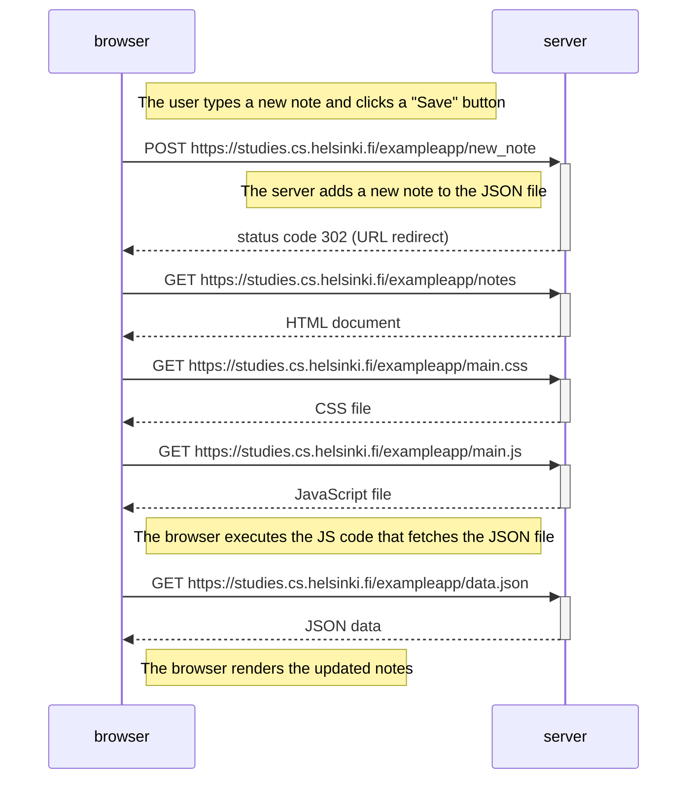

```mermaid
sequenceDiagram
    participant browser
    participant server

    Note right of browser: The user types a new note and clicks a "Save" button

    browser->>+server: POST https://studies.cs.helsinki.fi/exampleapp/new_note
    Note left of server: The server adds a new note to the JSON file
    server-->>-browser: status code 302 (URL redirect)

    browser->>+server: GET https://studies.cs.helsinki.fi/exampleapp/notes
    server-->>-browser: HTML document

    browser->>+server: GET https://studies.cs.helsinki.fi/exampleapp/main.css
    server-->>-browser: CSS file

    browser->>+server: GET https://studies.cs.helsinki.fi/exampleapp/main.js
    server-->>-browser: JavaScript file

    Note right of browser: The browser executes the JS code that fetches the JSON file

    browser->>+server: GET https://studies.cs.helsinki.fi/exampleapp/data.json
    server-->>-browser: JSON data

    Note right of browser: The browser renders the updated notes
```