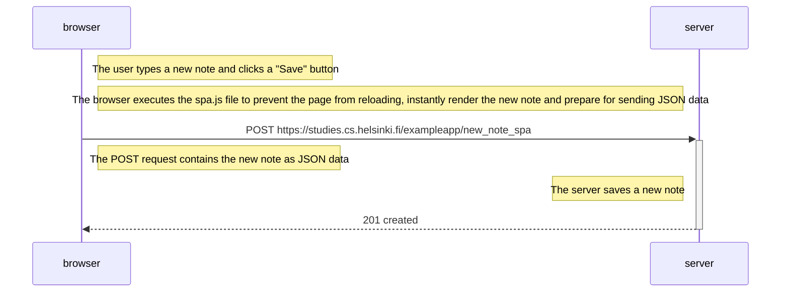

```mermaid
sequenceDiagram
    participant browser
    participant server

    Note right of browser: The user types a new note and clicks a "Save" button
    Note right of browser: The browser executes the spa.js file to prevent the page from reloading, instantly render the new note and prepare for sending JSON data

    browser->>+server: POST https://studies.cs.helsinki.fi/exampleapp/new_note_spa
    Note right of browser: The POST request contains the new note as JSON data
    Note left of server: The server saves a new note
    server-->>-browser: 201 created
```